# Agentic Design Patterns

Industry-standard patterns for LLM agent architectures. Each pattern describes a different approach to how an agent reasons, plans, acts, and learns.

*Compiled from: Google Cloud Architecture Center, LangChain/LangGraph, IBM, academic surveys (arxiv 2601.12560, 2510.25445), and production frameworks.*

---

## Single-Agent Patterns

### 1. ReAct (Reason + Act) / 5. CodeAct

**Config:** `loop: react`

ReAct interleaves reasoning with tool calls. CodeAct is ReAct where the agent prefers writing and executing code — same loop, different instructions.md guidance.

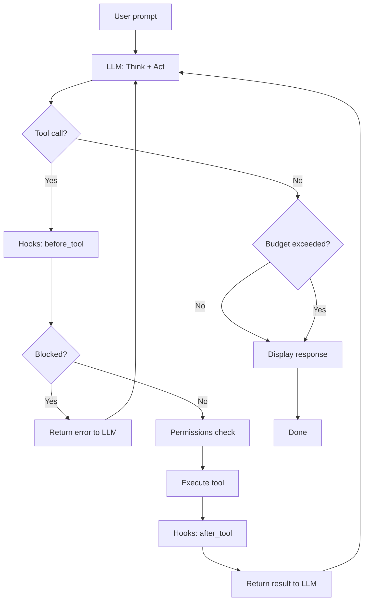

**When to use:** General-purpose tasks (ReAct). Data analysis and computation (CodeAct — add "prefer execute_code" to instructions.md).

### 2. Plan-and-Execute / 16. Deep Research

**Config:** `loop: plan_execute`

Plans all steps upfront (no tools), then executes each step as a mini ReAct loop. Deep Research is the same flow with search/extract/synthesise steps in the plan.

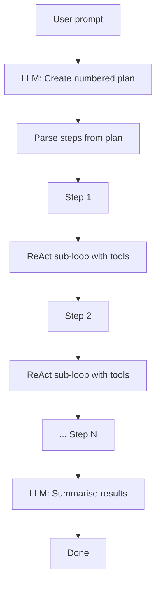

**When to use:** Multi-step tasks with predictable structure. Research tasks (Deep Research — use search tools in each step).

### 3. ReWOO (Reasoning Without Observation)

**Status:** Backlog — new loop file `loops/rewoo.py` (~50 lines)

Plan once with placeholders → execute all tools → solve once with all results. Only 2 LLM calls total vs ReAct's many.

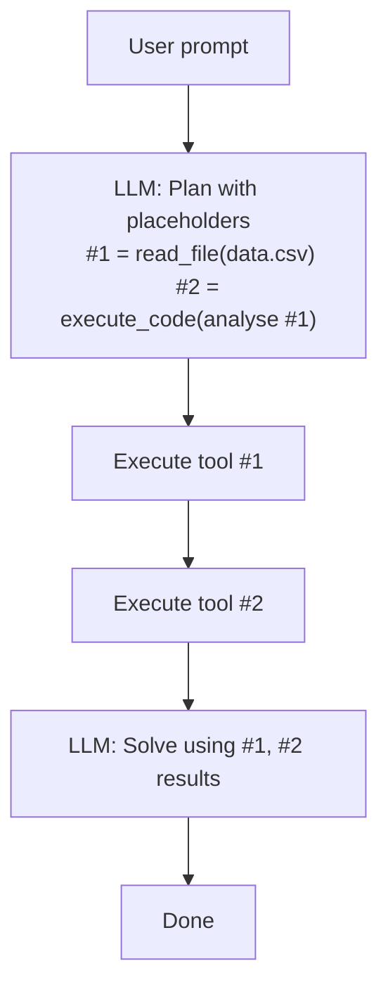

**When to use:** Multi-hop questions where tool calls can be predicted upfront.

### 4. Reflection / Self-Refine

**Status:** Backlog — new loop file `loops/reflection.py` (~40 lines)

Generate → critique → refine loop. The agent evaluates its own output and improves it.

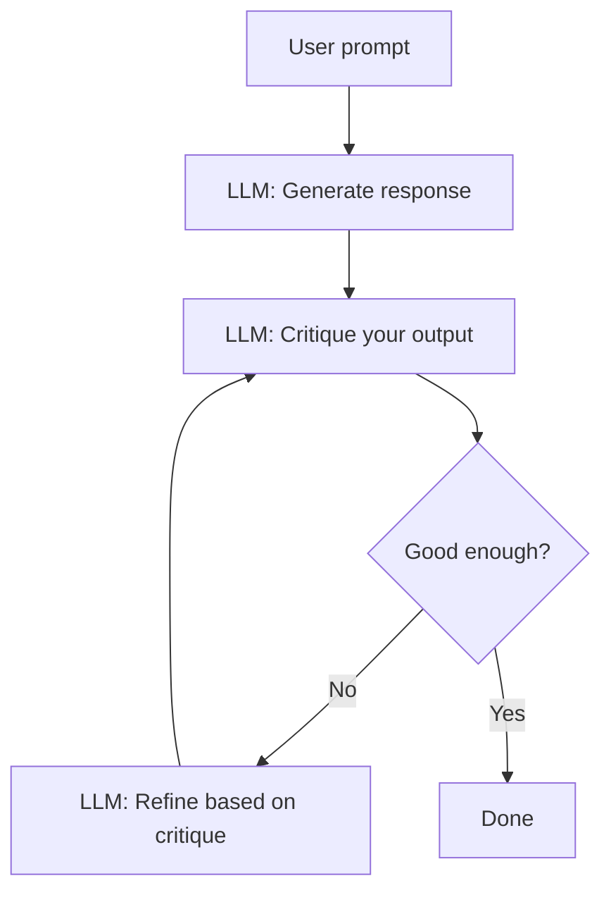

**When to use:** Writing, code generation, any task where quality improves with iteration.

### 8. Ralph Wiggum Loop (Naive Persistence)

**Status:** Backlog — new loop file `loops/ralph.py` (~30 lines)

Run agent → check completion → if failed, discard context and retry fresh. The philosophy: the agent *will* fail, and that's fine.

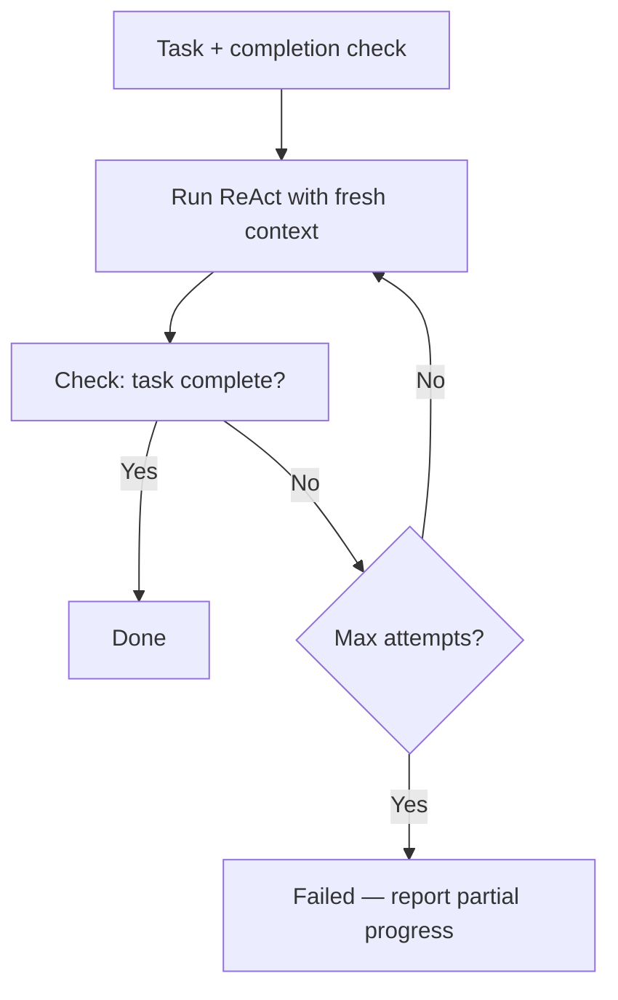

**When to use:** Coding tasks with testable completion (tests pass, linter clean).

---

## Multi-Agent Patterns

### 9. Orchestrator-Worker / 13. Mixture of Experts

**Implementation:** Orchestrator agent with `run_agent` tool. Routing defined in instructions.md.

MoE is the same flow but routing selects by domain (legal → legal-agent, technical → tech-agent).

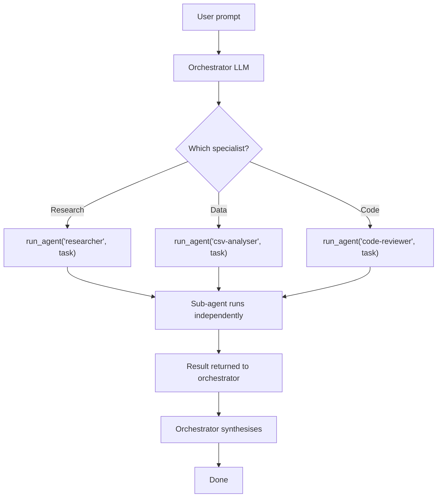

**Config:** Orchestrator uses `tools: [run_agent]`. Each worker has its own config with restricted tools and independent budget.

### 10. Evaluator-Optimizer

**Status:** Backlog — new loop file `loops/eval_optimize.py` (~50 lines)

Generator produces output, evaluator scores it, loop until quality threshold met.

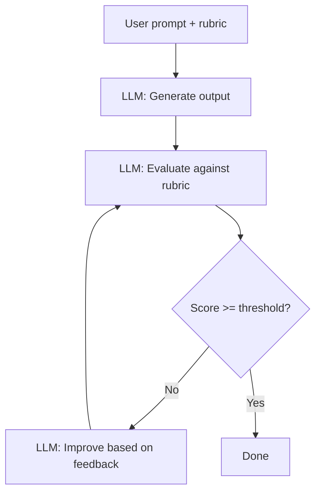

**When to use:** Content with quality standards. Code review. Any task with measurable criteria.

### 12. Pipeline / Sequential (Prompt Chaining)

**Implementation:** Chain of `run_agent` calls. Each agent processes and passes to the next.

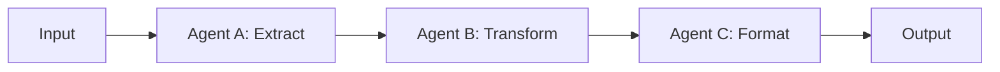

**Config:** Each agent is a separate folder. The first agent calls `run_agent` for the next in its instructions.md. Also works as prompt chaining within a single agent.

### 15. Agentic RAG

**Implementation:** ReAct loop + a retrieval/search tool. The loop is standard ReAct — the pattern emerges from the tools and instructions.

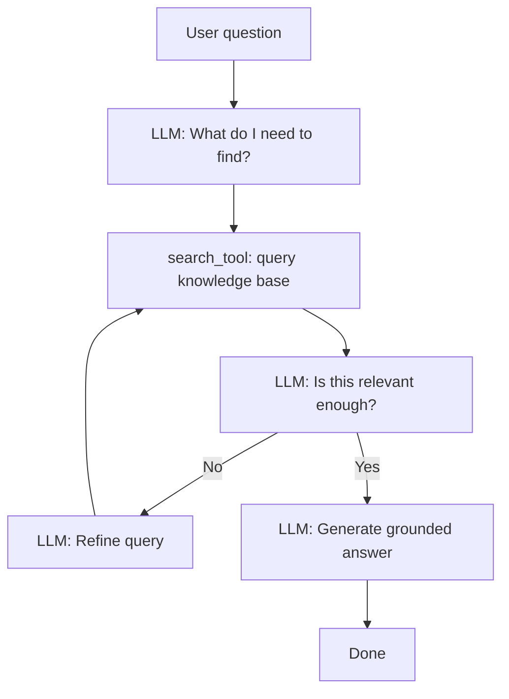

**Config:** `loop: react`, `tools: [search_tool, read_file]`. Needs a vector search tool (not built-in, but pluggable via tool registry).

---

## Multi-Agent Patterns — Backlog

### 11. Handoff / Relay

**Status:** Backlog — routing change (~20 lines in routing.py)

Active agent changes mid-conversation. Needs shared message state between agents.

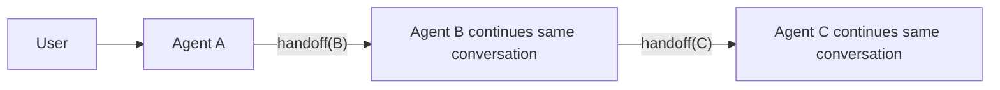

**What's needed:** Modify `run_agent` to optionally pass existing messages instead of creating fresh ones.

### 11b. Debate / Adversarial

**Status:** Backlog — new loop file `loops/debate.py` (~70 lines)

Two agents argue opposing positions, synthesiser reconciles.

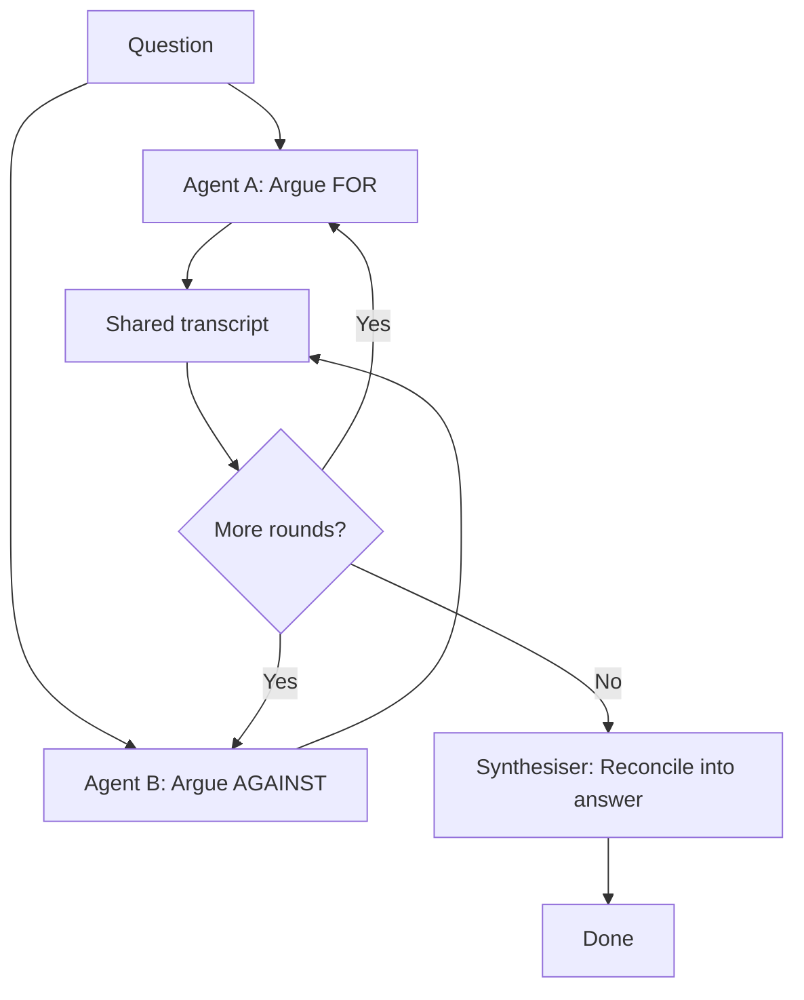

**What's needed:** New loop with two chat_fn calls per round + shared message list.

### 14. Parallelization (Fan-out / Fan-in)

**Status:** Backlog — script wrapper, no framework changes needed

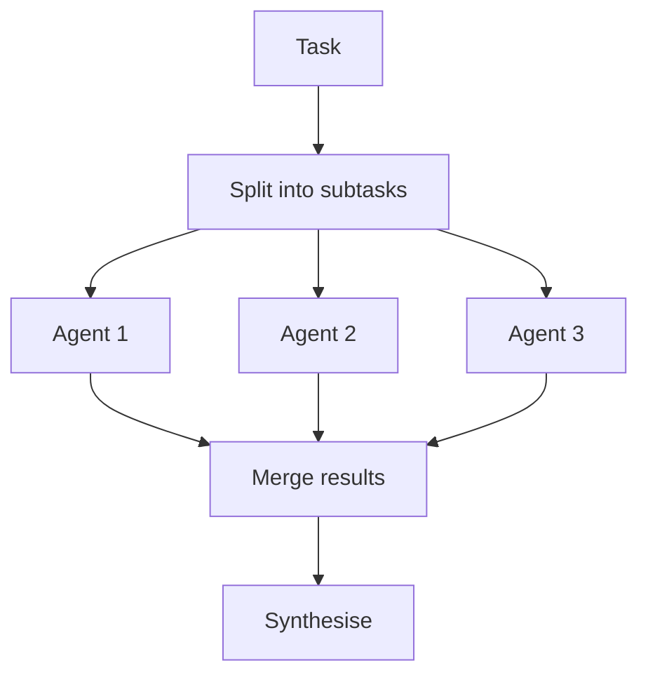

**Implementation:** Shell script with `&` and `wait`. Or Phase 8 async execution for in-process parallelism.

### 17. Consensus / Voting

**Status:** Backlog — script wrapper, no framework changes needed

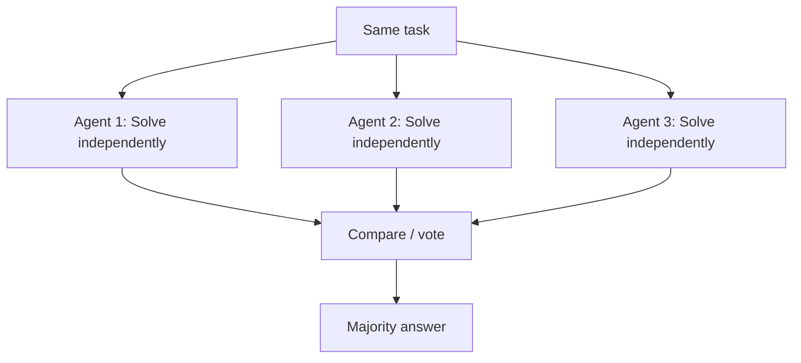

**Implementation:** Shell script running N agents in parallel, then a judge agent compares results.

---

## Needs Async (Phase 8 prerequisite)

### 6. Tree-of-Thoughts

**Status:** Backlog — needs async providers + branching logic (~100 lines)

Multiple reasoning paths explored simultaneously. Agent branches, evaluates, prunes.

### 7. LATS (Language Agent Tree Search)

**Status:** Backlog — needs async + tree data structure (~200 lines)

Monte Carlo Tree Search applied to agent reasoning. Research-grade, very expensive.

---

## Meta-Patterns (implemented as framework features)

### Guardrails — Implemented

Deterministic safety checks before and after tool execution. Our hooks system (hooks.py) — 5 hooks, all default-on.

### Human-in-the-Loop — Implemented

User approval gates at key decision points. Our permissions system (permissions.py) — three tiers: always_allow, always_ask, session memory.

---

## Sources

- [Google Cloud: Choose a design pattern for agentic AI](https://docs.cloud.google.com/architecture/choose-design-pattern-agentic-ai-system)
- [Agentic AI Design Patterns: ReAct, ReWOO, CodeAct, and Beyond](https://capabl.in/blog/agentic-ai-design-patterns-react-rewoo-codeact-and-beyond)
- [Arxiv: Architectures, Taxonomies, and Evaluation of LLM Agents](https://arxiv.org/html/2601.12560v1)
- [LangChain: Choosing the Right Multi-Agent Architecture](https://blog.langchain.com/choosing-the-right-multi-agent-architecture/)
- [7 Must-Know Agentic AI Design Patterns](https://machinelearningmastery.com/7-must-know-agentic-ai-design-patterns/)
- [Redis: AI Agent Architecture Patterns](https://redis.io/blog/ai-agent-architecture-patterns/)
- [Navigating Modern LLM Agent Architectures](https://www.wollenlabs.com/blog-posts/navigating-modern-llm-agent-architectures-multi-agents-plan-and-execute-rewoo-tree-of-thoughts-and-react)
- [Ralph Wiggum Loop — HumanLayer](https://www.humanlayer.dev/blog/brief-history-of-ralph)
